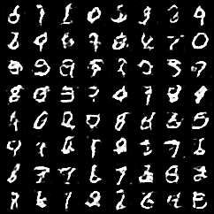
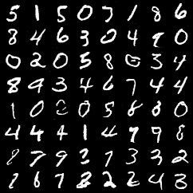
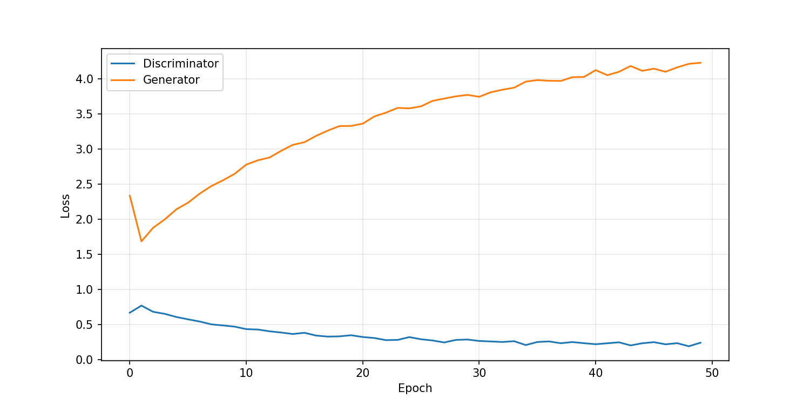

# advanced vision2025 assignment
アドバンストビジョン 2025年度 課題提出用リポジトリ

## 特徴
DCGAN(Deep Convolutional GAN) を用いて画像の生成を行うPythonスクリプト.  
MNIST（手書き数字の画像データセット）を使用した、学習のデモを確認できます.

## デモ内容
学習を進めると、ランダムノイズから手書き数字の画像が生成されるようになります.  
左は学習初期（1 epoch目）、右は学習終了時（50 epoch目）の生成サンプル.  
学習が進むにつれ、より鮮明な数字が出力されていることが確認できます.

|||
|:---:|:---:|
|1 epoch|50 epoch|


## 実行環境
以下の環境でプログラムの実行を確認済み
- Ubuntu 22.04 LTS
 - python 3.10
 - torch 2.9.1
 - torchvision 0.24.1
 - matplotlib 3.10.8

## インストール
1. リポジトリをクローン
```bash
git clone
cd adv2025
```

2. 必要なパッケージをインストール
```bash
pip install -r requirements.txt
```

## 使用方法
スクリプトを実行:
```bash
python dcgan_mnist.py
```

実行ログ（抜粋）
```bash
Device: cuda
学習開始: 50 epochs
Epoch [1/50] D: 0.6718, G: 2.3379
...
Epoch [50/50] D: 0.2441, G: 4.2315
実行完了 出力: outputs/, loss_plot.png, dcgan_model.pth
```  

出力された`loss_plot.png`から学習曲線を確認できます.


## リポジトリ構成
- `dcgan_mnist.py` : 学習を行うためのメインスクリプト
- `dcgan_model.pth` : 学習済みのモデルファイル
- `loss_plot.png` : 学習曲線
- `outputs` : 1 epochごとの生成サンプルを保存したディレクトリ
